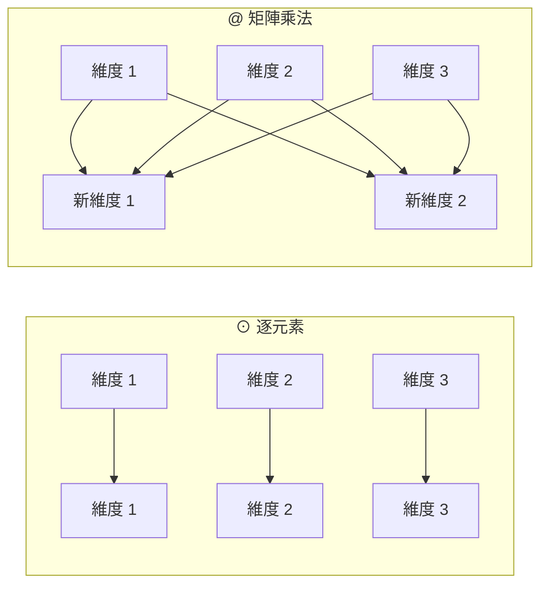

# 符號說明

其他文件裡用到的所有符號都在這裡。**建議先看這份**，尤其是 $\odot$ 和 `@` 那一節——
這兩個都叫「乘」，但完全是兩回事，混淆的話後面每條公式都會讀錯。

可執行的對照示範：

```bash
python tools/demo_operators.py
```

---

## 最容易混淆的兩個：$\odot$ 與 `@`

### $\odot$ 逐元素相乘（Hadamard product）

$$(A \odot B)_{ij} = A_{ij} \times B_{ij}$$

**位置對位置相乘，形狀不變。**

$$
A = \begin{bmatrix} 1 & 2 \\ 3 & 4 \end{bmatrix},
\qquad
B = \begin{bmatrix} 5 & 6 \\ 7 & 8 \end{bmatrix}
$$

$$
A \odot B = \begin{bmatrix} 1{\times}5 & 2{\times}6 \\ 3{\times}7 & 4{\times}8 \end{bmatrix}
= \begin{bmatrix} 5 & 12 \\ 21 & 32 \end{bmatrix}
$$

左上角那格 $= 1 \times 5 = 5$。**每一格只跟「同一格」的對手相乘**，跟其他格完全無關。

### `@` 矩陣乘法（matrix multiplication）

$$(A \mathbin{@} B)_{ij} = \sum_k A_{ik} \times B_{kj}$$

**左邊的「列」跟右邊的「行」做點積。**

$$
A \mathbin{@} B = \begin{bmatrix}
1{\times}5 + 2{\times}7 & 1{\times}6 + 2{\times}8 \\
3{\times}5 + 4{\times}7 & 3{\times}6 + 4{\times}8
\end{bmatrix}
= \begin{bmatrix} 19 & 22 \\ 43 & 50 \end{bmatrix}
$$

左上角那格 $= 1{\times}5 + 2{\times}7 = 19$。**用到了一整列和一整行**，也就是所有維度。

### 同樣的輸入，結果完全不同

| | $A \odot B$ | $A \mathbin{@} B$ |
|---|---|---|
| 左上角 | $5$ | $19$ |
| 算法 | 一對一相乘 | 一整列 · 一整行 |
| 形狀 | 必須相同，輸出也相同 | $(m,k) \mathbin{@} (k,n) \to (m,n)$ |
| **會不會混合維度** | **不會** | **會** |

---

## 為什麼「會不會混合維度」是關鍵



$\odot$ 的每一條線都是平行的，資訊不會橫向流動。
`@` 的每個輸出都吃進了所有輸入。

**這決定了它們在模型裡的角色**：

| 符號 | 出現在哪 | 做什麼 |
|---|---|---|
| `@` | `Linear`：$y = x \mathbin{@} W^{\top}$ | 把 $d$ 維換成另外 $d_{\text{out}}$ 維 |
| `@` | `Attention`：$QK^{\top}$ | 每個位置跟每個位置做點積 |
| `@` | 輸出層：$hE^{\top}$ | 隱藏狀態跟每個詞向量做點積 |
| $\odot$ | `RMSNorm`：$y = g \odot \hat{x}$ | 每個維度乘上自己的縮放係數 |
| $\odot$ | `SwiGLU`：$m = s \odot u$ | 閘門：每個維度各自決定放行多少 |
| $\odot$ | `RoPE`：$x \odot \cos$ | 每個維度乘上自己的旋轉係數 |

> **$\odot$ 永遠不會把不同維度的資訊混在一起。**
> 所以模型的「學習能力」幾乎全部來自 `@`，$\odot$ 只負責調整強度。

這也解釋了為什麼「疊很多個 $\odot$」沒有用——不管乘幾次，維度 1 永遠只影響維度 1。

---

## 形狀規則

```
x shape (4, 8)

x @ W.T   -> (4, 3)     (4,8) @ (8,3)    最後一維被換掉了
x ⊙ g     -> (4, 8)     (4,8) ⊙ (8,)     形狀完全不變
```

$x \odot g$ 用到了**廣播**（broadcasting）：$g$ 只有 8 個數字，
會自動複製 4 份，對 $x$ 的每一列各做一次逐元素相乘。

---

## 反向傳播的規則也不一樣

$$
y = a \odot b
\quad\Longrightarrow\quad
\frac{\partial L}{\partial a} = \frac{\partial L}{\partial y} \odot b,
\qquad
\frac{\partial L}{\partial b} = \frac{\partial L}{\partial y} \odot a
$$

$$
y = x \mathbin{@} W^{\top}
\quad\Longrightarrow\quad
\frac{\partial L}{\partial x} = \frac{\partial L}{\partial y} \mathbin{@} W,
\qquad
\frac{\partial L}{\partial W} = \left(\frac{\partial L}{\partial y}\right)^{\!\top} \mathbin{@} x
$$

兩個都符合同一句話：**對其中一邊微分，得到的就是另一邊**。

`tools/demo_operators.py` 用有限差分驗證了這兩條，誤差 $10^{-10}$ 等級。

---

## 其他符號

### 運算

| 符號 | 名稱 | 意思 |
|---|---|---|
| $\cdot$ | 點積 | 兩個向量對應相乘後加總，得到一個**純量**：$a \cdot b = \sum_k a_k b_k$ |
| $\otimes$ | 外積 | 兩個向量產生一個**矩陣**：$(a \otimes b)_{ij} = a_i b_j$ |
| $A^{\top}$ | 轉置 | 列與行互換：$(A^{\top})_{ij} = A_{ji}$ |
| $\sum_k$ | 求和 | 對指標 $k$ 把所有項加起來 |
| $\|x\|$ | 範數 | 向量長度：$\sqrt{\sum_k x_k^2}$ |
| $\leftarrow$ | 賦值 | 「用右邊的值取代左邊」，不是等式 |

$\cdot$ 和 `@` 的關係：`@` 就是把 $\cdot$ 做很多次。
$(A \mathbin{@} B)_{ij}$ 就是「$A$ 的第 $i$ 列」$\cdot$「$B$ 的第 $j$ 行」。

### 微分

| 符號 | 意思 |
|---|---|
| $\dfrac{\partial L}{\partial x}$ | $L$ 對 $x$ 的偏導數。白話：「把 $x$ 動一丁點，$L$ 會變多少」 |
| $\dfrac{\partial L}{\partial \mathbf{x}}$ | 對整個向量微分，結果跟 $\mathbf{x}$ 同形狀 |
| $f'(z)$ | 單變數函數的導數 |
| $\delta_{ij}$ | Kronecker delta：$i = j$ 時為 $1$，否則為 $0$ |

程式碼裡為了簡潔，$\dfrac{\partial L}{\partial x}$ 一律寫成 `dx`。

### 函數

| 符號 | 定義 |
|---|---|
| $\sigma(z)$ | sigmoid：$\dfrac{1}{1 + e^{-z}}$，把任意實數壓到 $(0,1)$ |
| $\operatorname{SiLU}(z)$ | $z\,\sigma(z)$，也叫 Swish |
| $\operatorname{softmax}(\mathbf{z})_i$ | $\dfrac{e^{z_i}}{\sum_k e^{z_k}}$，把一排分數變成機率（和為 $1$） |
| $\operatorname{mean}(x)$ | 平均值 |

### 形狀與維度

| 符號 | 意思 | 本專案的典型值 |
|---|---|---|
| $B$ | batch size，一次處理幾段文字 | 64 |
| $T$ | 序列長度，一段文字幾個 token | 128 |
| $d$ | 模型維度（hidden size） | 256 |
| $h$ | attention head 數 | 4 |
| $d_{\text{head}}$ | 每個 head 的維度，$= d / h$ | 64 |
| $d_{\text{ff}}$ | FFN 的中間維度 | 672 |
| $\left\lvert\mathcal{V}\right\rvert$ | 詞表大小 | 6400 |
| $N$ | 一個 batch 裡有效的預測位置數 | $B \times T$ |

張量形狀寫成 $(B,\,T,\,d)$，最後一維永遠是「特徵維度」。

---

## 常見的讀法陷阱

**① $W^{\top}$ 出現在哪一邊**

程式碼寫 `x @ W.T`，因為 PyTorch 的慣例是 $W$ 的形狀為 $(d_{\text{out}},\, d_{\text{in}})$。
所以要先轉置才對得上。數學文獻常寫成 $Wx$（$W$ 在左），兩者是同一件事，只是排列不同。

**② $\dfrac{\partial L}{\partial W}$ 的形狀**

永遠跟 $W$ 一樣。梯度是「每個參數各自的斜率」，所以有幾個參數就有幾個梯度。

**③ $\leftarrow$ 不是 $=$**

$$\theta \leftarrow \theta - \eta g$$

這是「更新」：用右邊算出來的值取代左邊。寫成 $\theta = \theta - \eta g$
在數學上是個無解的方程式。
