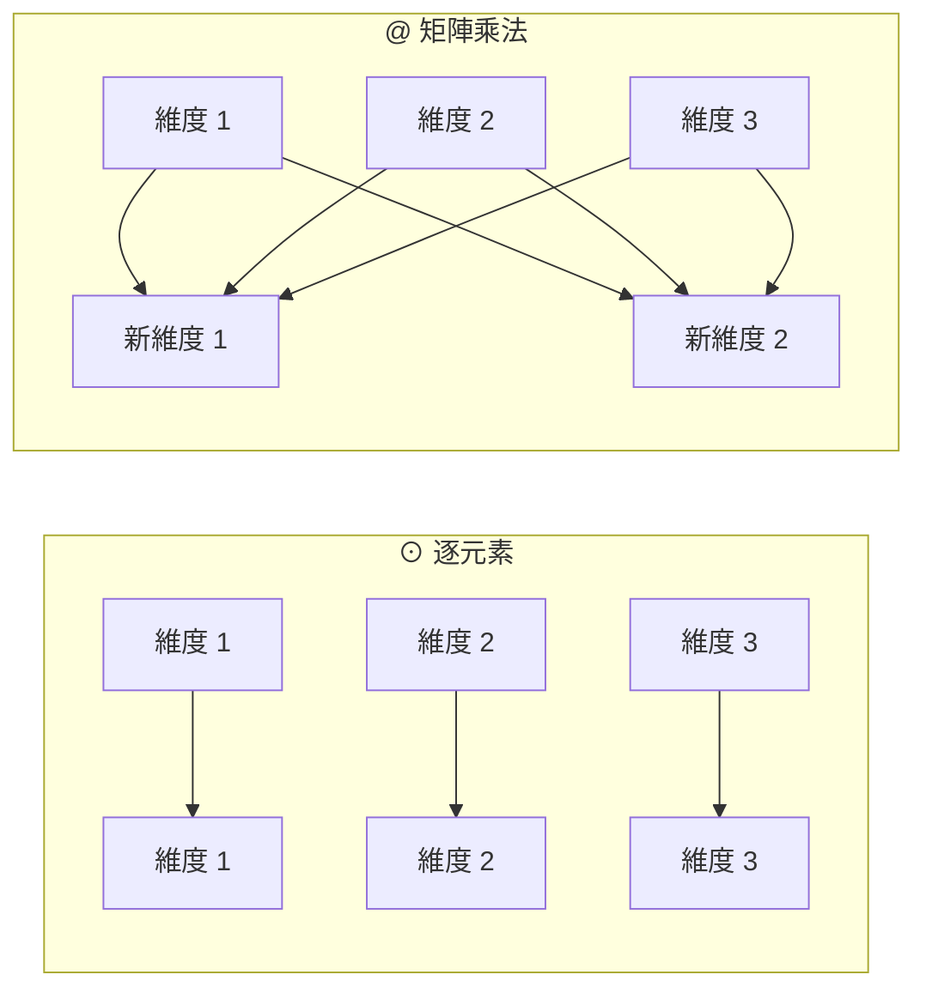

# 符號說明

其他文件裡用到的所有符號都在這裡。**建議先看這份**，尤其是 ⊙ 和 `@` 那一節——
這兩個都叫「乘」，但完全是兩回事，混淆的話後面每條公式都會讀錯。

可執行的對照示範：

```bash
python tools/demo_operators.py
```

---

## 最容易混淆的兩個：⊙ 與 `@`

### ⊙ 逐元素相乘（Hadamard product）

$$(A \odot B)_{ij} = A_{ij} \times B_{ij}$$

**位置對位置相乘，形狀不變。**

$$
A = \begin{bmatrix} 1 & 2 \\ 3 & 4 \end{bmatrix},
\qquad
B = \begin{bmatrix} 5 & 6 \\ 7 & 8 \end{bmatrix}
$$

$$
A \odot B = \begin{bmatrix} 1{\times}5 & 2{\times}6 \\ 3{\times}7 & 4{\times}8 \end{bmatrix}
= \begin{bmatrix} 5 & 12 \\ 21 & 32 \end{bmatrix}
$$

左上角那格 = 1 × 5 = 5。**每一格只跟「同一格」的對手相乘**，跟其他格完全無關。

### `@` 矩陣乘法（matrix multiplication）

$$(A \mathbin{@} B)_{ij} = \sum_k A_{ik} \times B_{kj}$$

**左邊的「列」跟右邊的「行」做點積。**

$$
A \mathbin{@} B = \begin{bmatrix}
1{\times}5 + 2{\times}7 & 1{\times}6 + 2{\times}8 \\
3{\times}5 + 4{\times}7 & 3{\times}6 + 4{\times}8
\end{bmatrix}
= \begin{bmatrix} 19 & 22 \\ 43 & 50 \end{bmatrix}
$$

左上角那格 = 1×5 + 2×7 = 19。**用到了一整列和一整行**，也就是所有維度。

### 同樣的輸入，結果完全不同

| | A ⊙ B | A @ B |
|---|---|---|
| 左上角 | 5 | 19 |
| 算法 | 一對一相乘 | 一整列 · 一整行 |
| 形狀 | 必須相同，輸出也相同 | (m,k) @ (k,n) → (m,n) |
| **會不會混合維度** | **不會** | **會** |

---

## 為什麼「會不會混合維度」是關鍵



⊙ 的每一條線都是平行的，資訊不會橫向流動。
`@` 的每個輸出都吃進了所有輸入。

**這決定了它們在模型裡的角色**：

| 符號 | 出現在哪 | 做什麼 |
|---|---|---|
| `@` | `Linear`：y = x @ Wᵀ | 把 d 維換成另外 d_out 維 |
| `@` | `Attention`：QKᵀ | 每個位置跟每個位置做點積 |
| `@` | 輸出層：hEᵀ | 隱藏狀態跟每個詞向量做點積 |
| ⊙ | `RMSNorm`：y = g ⊙ x̂ | 每個維度乘上自己的縮放係數 |
| ⊙ | `SwiGLU`：m = s ⊙ u | 閘門：每個維度各自決定放行多少 |
| ⊙ | `RoPE`：x ⊙ cos | 每個維度乘上自己的旋轉係數 |

> **⊙ 永遠不會把不同維度的資訊混在一起。**
> 所以模型的「學習能力」幾乎全部來自 `@`，⊙ 只負責調整強度。

這也解釋了為什麼「疊很多個 ⊙」沒有用——不管乘幾次，維度 1 永遠只影響維度 1。

---

## 形狀規則

```
x shape (4, 8)

x @ W.T   -> (4, 3)     (4,8) @ (8,3)    最後一維被換掉了
x ⊙ g     -> (4, 8)     (4,8) ⊙ (8,)     形狀完全不變
```

x ⊙ g 用到了**廣播**（broadcasting）：g 只有 8 個數字，
會自動複製 4 份，對 x 的每一列各做一次逐元素相乘。

---

## 反向傳播的規則也不一樣

先給結論，下面逐元素推導：

$$
y = a \odot b
\quad\Longrightarrow\quad
\frac{\partial L}{\partial a} = \frac{\partial L}{\partial y} \odot b,
\qquad
\frac{\partial L}{\partial b} = \frac{\partial L}{\partial y} \odot a
$$

$$
y = x \mathbin{@} W^{\top}
\quad\Longrightarrow\quad
\frac{\partial L}{\partial x} = \frac{\partial L}{\partial y} \mathbin{@} W,
\qquad
\frac{\partial L}{\partial W} = \left(\frac{\partial L}{\partial y}\right)^{\!\top} \mathbin{@} x
$$

差別只有一句話：

> ⊙：一個輸入只影響**一個**輸出 → 不用加總，直接乘
> `@`：一個輸入影響**多個**輸出 → 要把所有路徑**加起來**

可執行的逐元素推導：

```bash
python tools/demo_backward.py
```

---

### 先講清楚：dy 是哪來的

下面的推導裡會出現 dy₁ = 10 這種數字。**那是任意編的**，不是算出來的。

**在示範裡任意，是故意的。** backward 公式的正確性，要求它對**任何** dy 都成立——
這正是各層能自由組合的前提。所以測試時餵隨機值才是對的作法：

```python
# scratch/gradcheck.py
dy = torch.randn(y0.shape)     # 隨機的上游梯度
dx = layer.backward(dy)        # 用它測 backward
```

如果 backward 只對某些 dy 才對，那它就是錯的。
（這裡挑 10、100、1000 只是為了讓每個數字的來源追得出來——看到 1100 就知道是 100 × 11。）

**在真實模型裡，dy 是從上一層傳下來的。** 追蹤檔的實際數字：

| 層 | ‖dy‖（上游進來） | ‖dx‖（往下傳出去） |
|---|---:|---:|
| block3 | 0.006687 | 0.007068 |
| block2 | **0.007068** | 0.007881 |
| block1 | **0.007881** | 0.012044 |
| block0 | **0.012044** | 0.297985 |

**每一層的 dx 就是下一層的 dy**，數字完全相同。這就是「接力」的實際樣子。

（最後那個 0.012 → 0.298 的大跳躍，是 RMSNorm 除以 r ≈ 0.02 造成的放大。
見 [08-rmsnorm](08-rmsnorm.md)。）

**一直往上追，源頭只有一個。** 追到最頂端就沒有「上一層」了：

$$\frac{\partial L}{\partial \mathbf{z}} = \mathbf{p} - \mathbf{y}$$

這裡不是從別人那裡拿來的，是**算出來的**——p 是模型的預測，y 是正確答案。

```
dz = p − y            ← 唯一的源頭，只有這裡有「對錯」的資訊
  ↓  lm_head.backward
  ↓  final_norm.backward
  ↓  block3 ... block0     每一步都只是「翻譯」
dx = 送到 embedding 的修正單
```

---

### 推導一：y = a ⊙ b

先看**純量**版本。設 a₁ = 2、b₁ = 7：

$$y_1 = a_1 \times b_1 = 14$$

把 a₁ 加 1，y₁ 會加多少？**加 b₁ = 7**。所以

$$\frac{\partial y_1}{\partial a_1} = b_1$$

鏈鎖律接上去（設上游給的 dy₁ = 10）：

$$
\frac{\partial L}{\partial a_1}
= \underbrace{\frac{\partial L}{\partial y_1}}_{dy_1 = 10} \times \underbrace{\frac{\partial y_1}{\partial a_1}}_{b_1 = 7}
= 70
$$

**逐元素版本只是把這件事重複 n 次**——因為 a₁ 只影響 y₁，完全不碰 y₂、y₃：

| 維度 | dyᵢ | bᵢ | ∂L / ∂aᵢ = dyᵢ × bᵢ |
|---:|---:|---:|---|
| 1 | 10 | 7 | 10 × 7 = 70 |
| 2 | 100 | 11 | 100 × 11 = 1100 |
| 3 | 1000 | 13 | 1000 × 13 = 13000 |

**為什麼公式裡出現的是 b？** 因為 b 是**放大倍率**。
b₂ = 11 代表 a₂ 動一點點，y₂ 會動 11 倍——梯度傳回來當然要乘 11。

---

### 推導二：y = x @ Wᵀ

用 x = [2 3 5]、W = [1 0 -1 ; 4 2 0]，**先完全展開**：

$$y_1 = x_1 W_{11} + x_2 W_{12} + x_3 W_{13} = 2{\cdot}1 + 3{\cdot}0 + 5{\cdot}(-1) = -3$$

$$y_2 = x_1 W_{21} + x_2 W_{22} + x_3 W_{23} = 2{\cdot}4 + 3{\cdot}2 + 5{\cdot}0 = 14$$

**關鍵：x₁ 同時出現在 y₁ 和 y₂ 裡面。** 這是跟 ⊙ 最大的差別。

所以要把兩條路加起來（設 dy = [10 100]）：

$$
\frac{\partial L}{\partial x_1}
= dy_1 \frac{\partial y_1}{\partial x_1} + dy_2 \frac{\partial y_2}{\partial x_1}
= dy_1 W_{11} + dy_2 W_{21}
= 10{\times}1 + 100{\times}4 = 410
$$

$$\frac{\partial L}{\partial x_2} = 10{\times}0 + 100{\times}2 = 200,
\qquad
\frac{\partial L}{\partial x_3} = 10{\times}(-1) + 100{\times}0 = -10$$

**為什麼是 @ W 而不是 @ Wᵀ？**

看上面：xⱼ 配到的是 W₁ⱼ 和 W₂ⱼ——也就是 **W 的第 j 行（column）**。
而矩陣乘法 dy @ W 取的正好就是 W 的行。所以不用轉置。

$$\frac{\partial L}{\partial x} = dy \mathbin{@} W = \begin{bmatrix} 410 & 200 & -10 \end{bmatrix}$$

---

### 為什麼 ∂L / ∂W 要轉置

Wᵢⱼ **只出現在 yᵢ 裡面**，而且乘的是 xⱼ。所以

$$\frac{\partial L}{\partial W_{ij}} = dy_i \times x_j \qquad \text{（沒有加總，只有一項）}$$

| Wᵢⱼ | dyᵢ | xⱼ | 結果 |
|---|---:|---:|---:|
| W₁₁ | 10 | 2 | 20 |
| W₁₂ | 10 | 3 | 30 |
| W₁₃ | 10 | 5 | 50 |
| W₂₁ | 100 | 2 | 200 |
| W₂₂ | 100 | 3 | 300 |
| W₂₃ | 100 | 5 | 500 |

「每個 dyᵢ 乘上每個 xⱼ，排成一個矩陣」——這就是**外積**：

$$\frac{\partial L}{\partial W} = dy^{\top} \mathbin{@} x
= \begin{bmatrix} 20 & 30 & 50 \\ 200 & 300 & 500 \end{bmatrix}$$

---

### 忘記的時候：用形狀反推

實務上最好用的記憶法。**梯度的形狀永遠跟被微分的東西一樣**：

```
∂L/∂x 要是 (1,3)   ->   dy(1,2) @ W(2,3)      只有這樣接得起來
∂L/∂W 要是 (2,3)   ->   dyᵀ(2,1) @ x(1,3)
```

把形狀寫出來，答案通常**只有一種排法**。

---

### 為什麼 `@` 的反向也是矩陣乘法

因為矩陣乘法本身就是「乘完再加總」，而反向要做的正好是**路徑加總**——兩件事剛好同構。

`tools/demo_backward.py` 用有限差分驗證了全部四條規則，誤差 10⁻⁶ ~ 10⁻⁷ 等級。

---

## 其他符號

### 運算

| 符號 | 名稱 | 意思 |
|---|---|---|
| · | 點積 | 兩個向量對應相乘後加總，得到一個**純量**：a · b = Σₖ aₖ bₖ |
| ⊗ | 外積 | 兩個向量產生一個**矩陣**：(a ⊗ b)ᵢⱼ = aᵢ bⱼ |
| Aᵀ | 轉置 | 列與行互換：(Aᵀ)ᵢⱼ = Aⱼᵢ |
| Σₖ | 求和 | 對指標 k 把所有項加起來 |
| ‖x‖ | 範數 | 向量長度：√Σₖ xₖ² |
| ← | 賦值 | 「用右邊的值取代左邊」，不是等式 |

· 和 `@` 的關係：`@` 就是把 · 做很多次。
(A @ B)ᵢⱼ 就是「A 的第 i 列」·「B 的第 j 行」。

### 微分

| 符號 | 意思 |
|---|---|
| ∂L/∂x | L 對 x 的偏導數。白話：「把 x 動一丁點，L 會變多少」 |
| ∂L/∂x | 對整個向量微分，結果跟 x 同形狀 |
| f'(z) | 單變數函數的導數 |
| δᵢⱼ | Kronecker delta：i = j 時為 1，否則為 0 |

程式碼裡為了簡潔，∂L/∂x 一律寫成 `dx`。

### 函數

| 符號 | 定義 |
|---|---|
| σ(z) | sigmoid：1/(1 + e⁻z)，把任意實數壓到 (0,1) |
| SiLU(z) | zσ(z)，也叫 Swish |
| softmax(z)ᵢ | e^zᵢ/(Σₖ e^zₖ)，把一排分數變成機率（和為 1） |
| mean(x) | 平均值 |

### 形狀與維度

| 符號 | 意思 | 本專案的典型值 |
|---|---|---|
| B | batch size，一次處理幾段文字 | 64 |
| T | 序列長度，一段文字幾個 token | 128 |
| d | 模型維度（hidden size） | 256 |
| h | attention head 數 | 4 |
| d_head | 每個 head 的維度，= d / h | 64 |
| d_ff | FFN 的中間維度 | 672 |
| \|V\| | 詞表大小 | 6400 |
| N | 一個 batch 裡有效的預測位置數 | B × T |

張量形狀寫成 (B,T,d)，最後一維永遠是「特徵維度」。

---

## 常見的讀法陷阱

**① Wᵀ 出現在哪一邊**

程式碼寫 `x @ W.T`，因為 PyTorch 的慣例是 W 的形狀為 (d_out, dᵢₙ)。
所以要先轉置才對得上。數學文獻常寫成 Wx（W 在左），兩者是同一件事，只是排列不同。

**② ∂L/∂W 的形狀**

永遠跟 W 一樣。梯度是「每個參數各自的斜率」，所以有幾個參數就有幾個梯度。

**③ ← 不是 =**

$$\theta \leftarrow \theta - \eta g$$

這是「更新」：用右邊算出來的值取代左邊。寫成 θ = θ - η g
在數學上是個無解的方程式。
