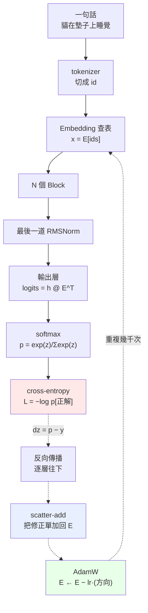
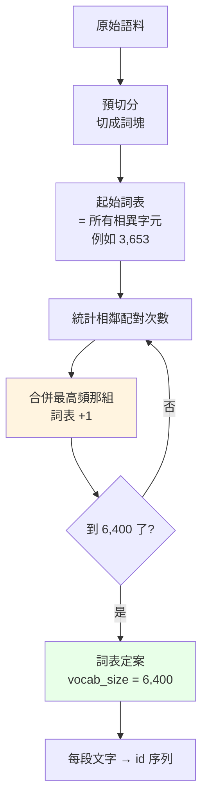
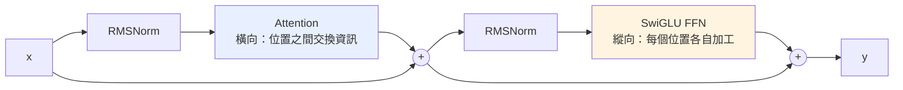

# 全景圖

一句話進去，到權重被改動，中間到底發生了什麼。

---

## 完整流程



實線是前向，虛線是反向。注意那條回到最上面的迴圈——**訓練就是這個迴圈跑幾千次**。

---

## 第 0 步：文字怎麼變成 id

上圖第二格的「tokenizer」其實是一個**獨立於模型之外**的階段。它在訓練開始前
就先跑完，之後整個訓練過程都不會再變動。



**這裡沒有任何學習，純粹是貪婪的頻率統計。** 沒有梯度、沒有神經網路。

$$\left|\mathcal{V}\right| = \left|\mathcal{V}_0\right| + M$$

實測：

```
起始詞表 3,653（4 特殊 + 3,649 字元）
目標 6,400 → 需要合併 2,747 次
             3,653 + 2,747 = 6,400
```

它為什麼是全景圖的一部分——**tokenizer 決定了模型的架構參數**：

| 決定了什麼 | 為什麼 |
|---|---|
| 詞表大小 $\left\lvert\mathcal{V}\right\rvert$ | 直接等於 embedding 的列數 |
| embedding 參數量 | $\left\lvert\mathcal{V}\right\rvert \cdot d$，這裡是 $6400 \times 256 = 1.6\,\text{M}$ |
| logits 張量大小 | $B \times T \times \left\lvert\mathcal{V}\right\rvert$，訓練時最大的中間張量 |
| 序列長度 | BPE 讓序列比字元級短約 30%，而 attention 是 $O(n^2)$，計算量差更多 |

切分效果的直接影響（同一個模型、同一份語料）：

```
原文     機器學習是人工智慧的一個分支
字元級   ['機','器','學','習','是','人','工','智','慧','的','一','個','分','支']   14 tokens
BPE      ['機器學習', '是', '人', '工智慧', '的一個', '分', '支']                  7 tokens
```

`機器學習` 變成**一個** token。這代表模型不必再從四個字元學會它們常常一起出現，
那件事在 tokenizer 階段就處理掉了。

細節見 [02-tokenizer](02-tokenizer.md)，程式碼在 `tokenizer/bpe.py`。

> **注意**：換 tokenizer 之後，loss 的數值**不能直接互相比較**。
> 字元級 3,195 詞表跑出 loss 2.24，BPE 6,400 詞表跑出 2.76，
> 但後者每個 token 攜帶的資訊量更大，猜對更難。要公平比較得換算成 bits-per-character：
>
> $$\text{bpc} = \frac{L \cdot N_{\text{token}}}{N_{\text{char}} \cdot \ln 2}$$

---

## 一個 Block 的內部



寫成公式：

$$\mathbf{h} = \mathbf{x} + \operatorname{Attention}\bigl(\operatorname{RMSNorm}(\mathbf{x})\bigr)$$

$$\mathbf{y} = \mathbf{h} + \operatorname{FFN}\bigl(\operatorname{RMSNorm}(\mathbf{h})\bigr)$$

三件事要記住：

1. **順序是 Norm → Attention → Norm → FFN。** 不是 FFN 先。

2. **那兩個 $+$ 是殘差。** 前向 $\mathbf{y} = \mathbf{x} + f(\mathbf{x})$，反向

   $$\frac{\partial L}{\partial \mathbf{x}} = \frac{\partial L}{\partial \mathbf{y}} + f'\left(\frac{\partial L}{\partial \mathbf{y}}\right)$$

   那個孤零零的 $\partial L / \partial \mathbf{y}$ 是「直達路徑」，梯度可以完全不衰減地穿過去。
   沒有殘差的話，20 層以上基本訓不動。

3. **Attention 橫向，FFN 縱向。** Attention 是唯一讓不同位置互通的地方；FFN 對每個位置各做各的。

---

## 資料的形狀怎麼變

以 $B = 8$、$T = 64$、$d = 256$、$\left\lvert\mathcal{V}\right\rvert = 6400$ 為例：

| 階段 | 形狀 | 說明 |
|---|---|---|
| token ids | $(8,\;64)$ | 整數 |
| 查表後 | $(8,\;64,\;256)$ | 每個位置一個 256 維向量 |
| 每個 Block 之後 | $(8,\;64,\;256)$ | **形狀不變**，只是內容被加工 |
| logits | $(8,\;64,\;6400)$ | 每個位置對整個詞表的分數 |
| loss | $()$ | 一個純量 |

注意 logits 那一步：

$$8 \times 64 \times 6400 = 3.27 \times 10^{6}$$

這通常是整個模型**最大的中間張量**，訓練時的記憶體大戶。

---

## 參數住在哪裡

跑 `python train.py` 會印出來，例如：

```
模型結構
==============================================================
  embedding                             204,480
  block0                                 47,232
  block1                                 47,232
  final_norm                                 64
  lm_head (與 embedding 共用)                    0
  ----------------------------------------------
  總計                                    299,008
  embedding 佔比                            68.4%
```

小模型的 embedding 佔比會很誇張，因為兩者的量級是

$$\underbrace{\left\lvert\mathcal{V}\right\rvert \cdot d}_{\text{embedding}}
\quad\text{vs}\quad
\underbrace{O(d^2)}_{\text{每一層}}$$

而小模型的 $\left\lvert\mathcal{V}\right\rvert \gg d$。真實的大模型 $d$ 大得多，
embedding 佔比會降到 5% 以下。

---

## 前向與反向的對稱

每一層的 `backward` 都在回答同一個問題：**「我的輸出該怎麼動」→「我的輸入該怎麼動」**。

| 層 | 前向 | 反向 |
|---|---|---|
| Linear | $\mathbf{y} = \mathbf{x}W^{\top}$ | $\dfrac{\partial L}{\partial \mathbf{x}} = \dfrac{\partial L}{\partial \mathbf{y}}W$，$\dfrac{\partial L}{\partial W} = \left(\dfrac{\partial L}{\partial \mathbf{y}}\right)^{\top}\mathbf{x}$ |
| Embedding | $\mathbf{x} = E_v$（gather） | $\dfrac{\partial L}{\partial E_v} = \sum\limits_{t \,:\, \mathrm{id}_t = v} G_t$（scatter-add） |
| RMSNorm | $\hat{x} = x / r$ | $\dfrac{1}{r}\left(a - \hat{x}\operatorname{mean}(a \odot \hat{x})\right)$ |
| RoPE | 旋轉 $+\theta$ | 旋轉 $-\theta$ |
| softmax + CE | $\mathbf{p} = \operatorname{softmax}(\mathbf{z})$ | $\dfrac{\partial L}{\partial \mathbf{z}} = \mathbf{p} - \mathbf{y}$ |
| 殘差 $\mathbf{y} = \mathbf{x} + f(\mathbf{x})$ | 分岔 | **相加** |

最後一列是通則：一個張量被用了 $k$ 次，它的梯度就是那 $k$ 條路的總和。

$$\frac{\partial L}{\partial \mathbf{x}} = \sum_{i=1}^{k} \frac{\partial L}{\partial \mathbf{x}}\bigg\rvert_{\text{第 } i \text{ 條路}}$$

---

## 下一步

- 想知道詞表大小怎麼定 → [02-tokenizer](02-tokenizer.md)
- 想知道 embedding 怎麼被訓練 → [03-embedding](03-embedding.md)
- 想跟著梯度走一遍 → [04-反向傳播](04-反向傳播.md)
