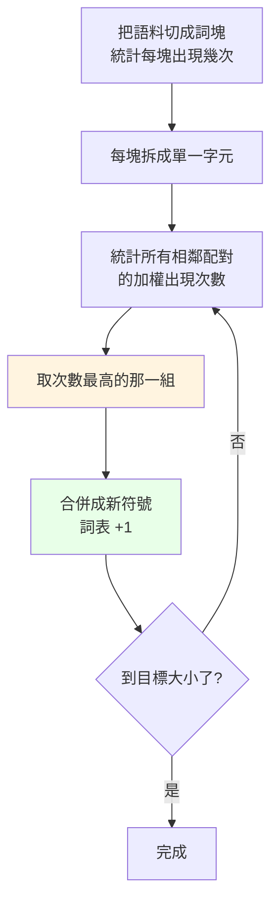

# 詞表大小是怎麼決定的

> 「minimind 的詞表 6400 個 token，這個數字是哪來的？」

**不是算出來的，是你自己挑的停止條件。**

$$\left|\mathcal{V}\right| = \underbrace{\left|\mathcal{V}_0\right|}_{\text{起始符號數}} + \underbrace{M}_{\text{合併次數}}$$

BPE 每合併一次，詞表就多一個。想要 $\left|\mathcal{V}\right| = 6400$，就合併到總數變成 6400 為止。

---

## 實際跑一次的數字

```bash
python tests/test_bpe.py
```

```
詞塊 183,640 個（相異 74,440 個），字元 546,000 個
起始詞表 3,653（4 特殊 + 3,649 字元）
目標 6,400 → 需要合併 2,747 次
                       3,653 + 2,747 = 6,400
```

看最後一行。就這麼直接。

---

## BPE 在做什麼



**沒有任何學習、沒有梯度、沒有神經網路。** 純粹是貪婪的頻率統計。

---

## 合併過程長什麼樣

`traces/bpe_training.txt` 會記下每一次合併：

```
合併 #1      ('可', '以') 出現 2,362 次  ->  新 token '可以'    詞表 3,654
合併 #2      ('我', '們') 出現 1,988 次  ->  新 token '我們'    詞表 3,655
...
合併 #1000   ('歌', '詞') 出現    40 次  ->  新 token '歌詞'    詞表 4,653
合併 #2000   ('排', '放') 出現    21 次  ->  新 token '排放'    詞表 5,653
```

注意**出現次數一路遞減**：2362 → 1988 → ... → 40 → 21。

這給了一個很實用的判斷：**如果最後幾次合併的次數已經降到個位數，
代表詞表開太大了**，那些 token 學不到什麼東西。反過來，如果停下來的時候
次數還有好幾百，代表還可以再擴。

---

## 效果

```
500 段，共 140,502 字元
  字元級    140,502 tokens   1.000 token/字
  BPE        99,202 tokens   0.706 token/字
  BPE 讓序列短了 29.4%
```

切分對照：

```
原文     機器學習是人工智慧的一個分支
字元級   ['機','器','學','習','是','人','工','智','慧','的','一','個','分','支']
BPE      ['機器學習', '是', '人', '工智慧', '的一個', '分', '支']
```

`機器學習` 變成一個 token 了。序列變短的直接好處：

- 同樣的 context window 能裝更多內容
- Attention 是 O(n²)，序列短一半，注意力的計算量剩四分之一

---

## 為什麼順序不能亂

編碼的時候要**照訓練時學到的順序**套用合併：

```
'機器學習' 這個 token 存在的前提，是 '機器' 和 '學習' 已經先被合併出來了。
```

所以 `bpe.py` 裡每個合併都記了 `rank`（第幾次學到的），編碼時永遠先套 rank 最小的。

---

## 這份實作與生產級的差別

| | 這裡 | GPT-2 / Qwen / minimind |
|---|---|---|
| 起始符號 | 語料裡的**字元** | 256 個 **byte** |
| OOV | 用 `<unk>` | 不可能有（任何字都能拆成 byte） |
| 追蹤檔可讀性 | 每個符號都是你認得的字 | 生僻字會變成看不懂的 byte 碎片 |

byte-level 的代價，在前面的實驗裡量過：用簡體訓的 tokenizer 去吃繁體語料時，
「這」會被拆成兩個 byte 碎片，序列長度膨脹 1.67 倍。因為那些繁體字**根本不在詞表裡**。

這也是為什麼換語言、換領域時，tokenizer 常常得重訓。

---

## 一個容易忽略的連結

詞表大小直接決定了 embedding 的參數量：

$$\left|\theta_{\text{embed}}\right| = \left|\mathcal{V}\right| \times d$$

$6400 \times 768 = 4{,}915{,}200$。詞表開兩倍，embedding 就大兩倍。

而且因為 weight tying，同一個矩陣還兼任輸出層——所以詞表大小也直接決定了
最後那個 logits 張量有多大：

$$\text{logits} \in \mathbb{R}^{B \times T \times \left|\mathcal{V}\right|}$$

那通常是訓練時**最大的中間張量**。以 $B=64$、$T=128$、$\left|\mathcal{V}\right|=6400$ 為例，
光這一個張量就有 $5.24 \times 10^{7}$ 個數字。

**詞表大小不只是 tokenizer 的參數，它同時是模型的架構參數。**
