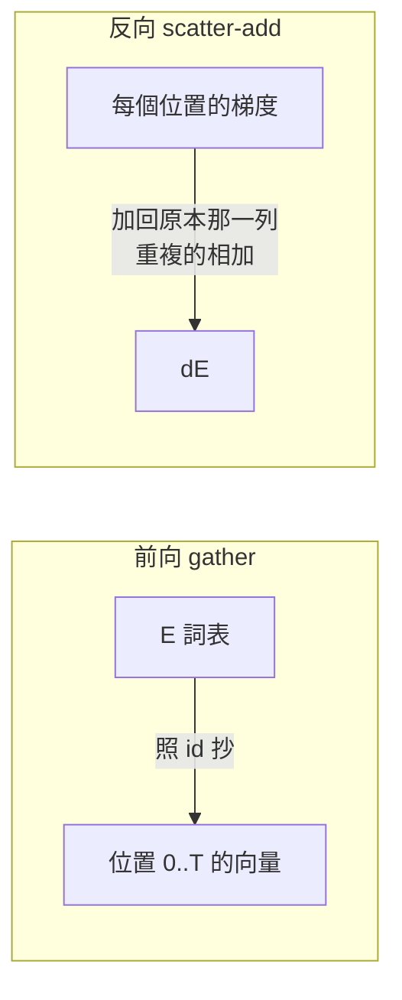

# Embedding 與 scatter-add

對應程式碼：`scratch/embedding.py`

---

## 它不是資料，是權重

最容易誤會的一點：E **看起來像一張查詢表**，所以直覺會把它歸類成「輸入」。

但它在 `model.params()` 裡跟 `q_proj.W` 排在一起，用同一個 optimizer、
同樣的 η、同樣的更新規則。跑 `train.py` 印出的參數表就是證據：

```
model.embed.E                 204,480     ← 就是它
block0.attn.q_proj.W           16,384
block0.ffn.gate_proj.W         43,776
...
optimizer 拿到 20 個參數張量
```

> **「embedding 有一套自己的訓練方法」——這件事不存在。**

---

## 查表 = one-hot 矩陣乘法

$$\mathbf{x} = \operatorname{onehot}(v)\,E, \qquad E \in \mathbb{R}^{V \times d}$$

onehot(v) 只有第 v 個元素是 1、其餘全 0。乘出來就是把 E 的第 v 列抄出來：

$$x_j = \sum_{k=1}^{V} \operatorname{onehot}(v)_k \, E_{kj} = E_{vj}$$

既然 (V-1)/V = 99.98% 的乘法都是「乘以 0」，實作當然直接索引：

```python
x = E[ids]
```

兩者**結果逐位元相同**，實測查表快 20 倍以上、省 8 倍記憶體。

把它看成矩陣乘法很重要——**因為反向就是從這裡推出來的**。

---

## 反向：scatter-add

把整批寫成矩陣形式 X = OE（O 是常數 one-hot 矩陣），
套用線性層的標準結果：

$$\frac{\partial L}{\partial E} = O^{\top} G, \qquad G = \frac{\partial L}{\partial X}$$

Oᵀ 的第 v 列，在「第 t 個位置的 id 等於 v」的地方是 1，其餘是 0。展開得到：

$$\boxed{\;\frac{\partial L}{\partial E_v} = \sum_{t \,:\, \text{id}_t = v} G_t\;}$$

白話：**把每個位置的梯度，加回它當初查表的那一列；同一列有多筆就相加。**



由此直接得到兩個常被誤會成「特殊規則」的性質——其實都只是算出來的結果：

| 現象 | 為什麼 |
|---|---|
| 同一個 token 出現 k 次 → 那一列收到 k 筆梯度**相加** | Oᵀ 那一列有 k 個 1，矩陣乘法自然就加起來了 |
| 沒出現過的 token → 梯度是 0 | Oᵀ 那一列全是 0 |

---

## 追蹤檔裡的實際數字

```
embed · backward（scatter-add，輸入側）
    公式:  dE[v] += Σ_{t : id_t = v}  dx[t]
    「id 4」在這一批出現 27 次
    看第 0 維，這 27 筆修正單相加：
        位置 1      dx[0] = +1.09540625e-02
        位置 12     dx[0] = +5.40754059e-03
        ...
        這 27 筆相加 =               +1.67316496e-02
```

---

## 但梯度其實有兩條路

這是最容易混淆的地方。因為 weight tying（E 同時是輸出層的權重），它會收到**兩份**梯度。

輸出側那條有封閉解。因為 logitsₜ = hₜ Eᵀ：

$$\frac{\partial L}{\partial E_v}\bigg|_{\text{out}} = \frac{1}{N}\sum_{t}\left(p_t[v] - y_t[v]\right)\mathbf{h}_t$$

實測：

| 來源 | ∂L/∂E₄[0] | 有幾列非零 |
|---|---:|---:|
| 輸入側（scatter-add） | +0.01673 | 272 / 3195 ← **稀疏** |
| 輸出側（weight tying） | +0.00500 | 3195 / 3195 ← **稠密** |
| **合計** | +0.02174 | 3195 / 3195 |

| | 來自哪裡 | 稀疏還是稠密 |
|---|---|---|
| 輸入側 | 查表這條路，backprop 傳回來的 | **稀疏**，只有出現過的 token |
| 輸出側 | logits = hEᵀ，softmax 那條路 | **稠密**，每一步每一列都被碰到 |

所以「embedding 的梯度是稀疏的」這句話，**在有 weight tying 的模型上並不成立**。

想親眼驗證：把 `TinyLM(..., tie_weights=False)` 跑一次，非零列就會剩下 272。

注意這裡的點積是「隱藏狀態 · 詞向量」，**不是**「詞向量 · 詞向量」。
訓練過程中從來沒有計算過任何兩個詞向量之間的相似度——cosine 只是我們事後檢查用的量尺。

---

## 「離散的 id 怎麼微分？」

**不對 id 微分。**

| | 是什麼 | 離散/連續 | 微分嗎 |
|---|---|---|---|
| id = 4 | 資料 | 離散 | **不用，也不能** |
| E₄,0 = -0.0153 | 參數 | 連續實數 | **對它微分** |

梯度問的是：

$$\frac{\partial L}{\partial E_{4,0}} = \lim_{\varepsilon \to 0}\frac{L(E_{4,0}+\varepsilon) - L(E_{4,0}-\varepsilon)}{2\varepsilon}$$

這個問題跟 id 是不是離散**完全無關**。id 只決定「哪些數字參與計算」。

沒參與的，斜率算出來自然是 0：

$$f(a,b,c) = a + b \quad\Longrightarrow\quad \frac{\partial f}{\partial c} = 0$$

不是「不能微分」，是「算出來就是 0」。

有限差分實測（ε = 10⁻³，句子含重複的「在」）：

| 格子 | (L₊ − L₋) / 2ε | 公式 | 說明 |
|---|---:|---:|---|
| E₂,0（在） | 0.246048 | 0.246000 | 查兩次，斜率加倍 |
| E₀,0（貓） | 0.123024 | 0.123000 | 查一次 |
| E₁,0（狗） | 0.000000 | 0.000000 | **沒被查到** |

「狗」那一列 L(w+ε) 和 L(w-ε) **完全相等**——
那個數字沒參與計算，動它 L 不會變。

`tests/test_layers.py` 對這一層的驗證結果：相對誤差 6.80×10⁻¹⁴。

---

## 延伸：離散在哪裡才真的會咬人

| 情境 | 可微嗎 |
|---|---|
| **訓練**（teacher forcing） | 可微。id 是資料集給定的常數 |
| **生成**（argmax / 取樣選下一個 token） | **不可微**，梯度在這裡斷掉 |

第二種才是真麻煩——這正是 RLHF / GRPO 那類「用生成結果的好壞來訓練」的方法
需要 policy gradient 之類特殊技巧的原因。

訓練 embedding 完全不碰這個問題。
