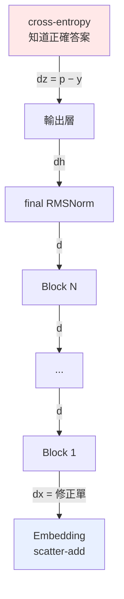

# 反向傳播全鏈

從 p - y 一路走回 E。

---

## 整條鏈只有一個地方知道「對錯」



**只有最上面那一格含有「答案」的資訊。** 往下每一層都只是在做微分，
不知道任務是什麼、不知道「貓是動物」。

---

## 第一棒：∂L/∂z = p - y

softmax 和 cross-entropy 分開推都很醜（會出現 V × V 的 Jacobian），
但合起來推會神奇地簡化。

softmax 的 Jacobian：

$$\frac{\partial p_i}{\partial z_j} = p_i\left(\delta_{ij} - p_j\right)$$

接上 cross-entropy（L = −log pᵧ，pᵧ 是正解那一格的機率）：

$$
\frac{\partial L}{\partial z_j}
= \sum_i \frac{\partial L}{\partial p_i}\cdot\frac{\partial p_i}{\partial z_j}
= -\frac{1}{p_y}\cdot p_y\left(\delta_{yj} - p_j\right)
= p_j - \delta_{yj}
$$

整個 Jacobian 消失，只剩：

$$\boxed{\;\frac{\partial L}{\partial \mathbf{z}} = \mathbf{p} - \mathbf{y}\;}$$

其中 y 是正解的 one-hot。翻成白話：**正解那一格的分數要拉高，其他全部壓低。**

追蹤檔裡看到的：

| token id | p | y | (p-y)/N | 作用 |
|---:|---:|---:|---:|---|
| 213 | 0.35341 | 0 | +0.003534 | 壓下去 |
| 57 | 0.11518 | 0 | +0.001152 | 壓下去 |
| **4** | 0.11176 | **1** | -0.008882 | **拉上來**（正解） |

（除以 N 是因為 loss 對所有有效位置取了平均。）

---

## 中間每一棒都在做同一件事

每一層的 `backward` 都回答：**「我的輸出該怎麼動」→「那我的輸入該怎麼動」**。
翻譯的方法就是用自己的導數。

### Linear：y = xWᵀ

$$
\frac{\partial L}{\partial \mathbf{x}} = \frac{\partial L}{\partial \mathbf{y}}\,W
\qquad
\frac{\partial L}{\partial W} = \left(\frac{\partial L}{\partial \mathbf{y}}\right)^{\!\top}\mathbf{x}
$$

注意 ∂L/∂x 用 W、∂L/∂W 用 x ——
**點積對其中一邊微分，得到的就是另一邊。** 這條規律整份程式碼裡反覆出現。

### 逐元素的非線性：z = f(a)

$$\frac{\partial L}{\partial \mathbf{a}} = \frac{\partial L}{\partial \mathbf{z}} \odot f'(\mathbf{a})$$

SiLU 的導數（用 σ' = σ(1-σ) 推）：

$$\mathrm{SiLU}(z) = z\,\sigma(z), \qquad \mathrm{SiLU}'(z) = \sigma(z)\bigl(1 + z(1-\sigma(z))\bigr)$$

### 殘差：y = x + f(x)

$$\frac{\partial L}{\partial \mathbf{x}} = \frac{\partial L}{\partial \mathbf{y}} + f'\!\left(\frac{\partial L}{\partial \mathbf{y}}\right)$$

那個孤零零的 ∂L / ∂y 就是「直達路徑」——梯度可以完全不衰減地穿過去。
**沒有殘差的話，20 層以上基本訓不動。**

### 通則

$$\text{前向分岔} \;\Longrightarrow\; \text{反向相加}$$

x 在 SwiGLU 裡同時餵給 gate 和 up 兩路，所以

$$\frac{\partial L}{\partial \mathbf{x}} = \frac{\partial L}{\partial \mathbf{x}}\bigg|_{\text{gate}} + \frac{\partial L}{\partial \mathbf{x}}\bigg|_{\text{up}}$$

Attention 裡 x 餵給 Q、K、V 三路，所以三份相加。

---

## RMSNorm：一個需要商法則的推導

前向：

$$
r = \sqrt{\frac{1}{n}\sum_k x_k^2 + \varepsilon},
\qquad \hat{x} = \frac{x}{r},
\qquad y = g \odot \hat{x}
$$

先求 r 對 x 的偏導：

$$\frac{\partial r}{\partial x_j} = \frac{1}{2}\left(\cdot\right)^{-1/2}\cdot\frac{2x_j}{n} = \frac{x_j}{n\,r}$$

yᵢ 透過兩條路依賴 xⱼ（分子的 xᵢ、分母 r 裡的 xⱼ）：

$$
\frac{\partial y_i}{\partial x_j}
= g_i\left[\frac{\delta_{ij}}{r} - \frac{x_i}{r^2}\cdot\frac{\partial r}{\partial x_j}\right]
= g_i\left[\frac{\delta_{ij}}{r} - \frac{x_i x_j}{n\,r^3}\right]
$$

令 aᵢ = ∂L/∂yᵢgᵢ，鏈鎖律加總後化簡：

$$\boxed{\;\frac{\partial L}{\partial x} = \frac{1}{r}\Bigl(a - \hat{x}\cdot\operatorname{mean}(a \odot \hat{x})\Bigr)\;}$$

$$\frac{\partial L}{\partial g} = \sum_{\text{所有位置}} \frac{\partial L}{\partial y} \odot \hat{x}$$

第二項 -x̂mean(a⊙x̂) 的意義是**把沿著 x̂ 方向的分量扣掉**——
因為 x̂ 的長度已經被 r 固定住了，沿它自己的方向推是無效的。

---

## Attention：含完整 softmax Jacobian

前向：

$$
S = \frac{QK^{\top}}{\sqrt{d_{\text{head}}}},
\qquad
S_{ij} \leftarrow -\infty \;\text{ if } j > i,
\qquad
A = \operatorname{softmax}(S),
\qquad
O = AV
$$

除以 √d_head 的理由：Q、K 各維度變異數約為 1，
點積 d 個維度後變異數變成 d，標準差 √d。
d = 64 時分數會散到 ± 8 以上，softmax 吃到這種輸入會變得極度尖銳，梯度就消失了。

反向：

$$
\frac{\partial L}{\partial A} = \frac{\partial L}{\partial O}V^{\top},
\qquad
\frac{\partial L}{\partial V} = A^{\top}\frac{\partial L}{\partial O}
$$

這裡沒有 cross-entropy 接在後面，所以要用**完整**的 softmax 反向（逐列獨立）：

$$\frac{\partial L}{\partial S_j} = A_j\left(\frac{\partial L}{\partial A_j} - \sum_i \frac{\partial L}{\partial A_i}A_i\right)$$

括號裡那個 Σ 是「這一列的加權平均」，每一列算一次就好。

$$
\frac{\partial L}{\partial Q} = \frac{1}{\sqrt{d}}\,\frac{\partial L}{\partial S}\,K,
\qquad
\frac{\partial L}{\partial K} = \frac{1}{\sqrt{d}}\left(\frac{\partial L}{\partial S}\right)^{\!\top} Q
$$

被遮罩的位置 Aᵢⱼ = 0，公式裡的 Aⱼ(·s) 自動讓梯度也是 0，**不需要另外處理**。

---

## 最後一棒：embedding 只做路由

embedding 的前向是「原封不動抄出來」，導數是 1。
所以反向也是「原封不動接回去」——**它不對梯度做任何變換，只負責送回正確的列**。

$$\text{前向 gather} \quad\Longleftrightarrow\quad \text{反向 scatter-add}$$

這個對稱不是設計出來的，是導數為 1 的必然結果。

---

## 一個實測現象：梯度會被放大

追蹤檔裡可以看到梯度範數逐層變化。從第 1 層傳到 embedding 時會突然放大約一個數量級。

原因是 **RMSNorm**。embedding 向量的 rms 約為 0.03：

$$\text{前向除以 } 0.03 \;\Longrightarrow\; \text{放大約 } 33 \text{ 倍}$$

反向經過同一個除法時，梯度也跟著放大。
（第二項 -x̂mean(a⊙x̂) 會抵消掉一部分，所以實測倍率比 1/r 略小。）

---

## 怎麼確定推對了

不用 PyTorch 對答案，直接回到梯度的定義：

$$\frac{\partial L}{\partial w} \approx \frac{L(w+\varepsilon) - L(w-\varepsilon)}{2\varepsilon}$$

```bash
python tests/test_layers.py
```

| 層 | 最大相對誤差 | |
|---|---:|---|
| Linear（無 bias） | 2.29×10⁻¹² | PASS |
| Linear（有 bias） | 2.03×10⁻¹² | PASS |
| RMSNorm | 2.13×10⁻⁷ | PASS |
| Embedding（scatter-add） | 6.80×10⁻¹⁴ | PASS |
| TiedOutputHead | 5.61×10⁻¹² | PASS |
| SwiGLU | 1.69×10⁻⁶ | PASS |
| RoPE | 2.19×10⁻¹² | PASS |
| CausalSelfAttention | 3.32×10⁻⁷ | PASS |
| Softmax + CrossEntropy | 7.50×10⁻⁸ | PASS |

用**中央差分**（兩邊各推一次）而不是單邊，因為誤差是 O(ε²) 而不是 O(ε)。

ε 也不能太小——`float32` 只有約 7 位有效數字，兩個相近的數相減會被捨入誤差吃掉。
所以 `gradcheck` 預設用 `float64` 跑。

---

## 反向傳播不會修改任何權重

```python
model.backward(dlogits)      # 只算出「該往哪修」，存進 dW / dE
opt.step()                   # 這一行才真的改動權重
```

`backward()` 跑完之後，E 一個數字都沒變。梯度存在另一個張量裡。

真正動手的是 optimizer，而且方向**相反**（往下坡走）、步伐只有 lr 那麼小。
詳見 [05-adamw](05-adamw.md)。
