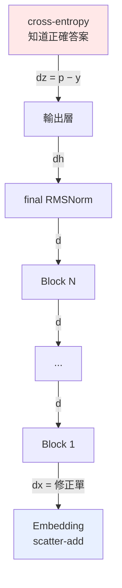

# 反向傳播全鏈

從 `p − y` 一路走回 `E`。

---

## 整條鏈只有一個地方知道「對錯」



**只有最上面那一格含有「答案」的資訊。** 往下每一層都只是在做微分，
不知道任務是什麼、不知道「貓是動物」。

---

## 第一棒：`dz = p − y`

softmax 和 cross-entropy 分開推都很醜（會出現 V×V 的 Jacobian），
但合起來推會神奇地簡化：

```
L = −log p_y
∂L/∂z_j = Σ_i (∂L/∂p_i)(∂p_i/∂z_j)
        = −(1/p_y) · p_y(δ_yj − p_j)
        = p_j − δ_yj
```

整個 Jacobian 消失，只剩：

```
∂L/∂z = p − y
```

翻成白話：**正解那一格的分數要拉高，其他全部壓低。**

追蹤檔裡看到的：

```
 token id            p        y   dz = (p−y)/N       作用
      213      0.35341      0.0      +0.003534    壓下去
       57      0.11518      0.0      +0.001152    壓下去
        4      0.11176      1.0      −0.008882    拉上來   ← 正解
```

---

## 中間每一棒都在做同一件事

每一層的 `backward` 都回答：**「我的輸出該怎麼動」→「那我的輸入該怎麼動」**。

翻譯的方法就是用自己的導數。舉三個例子：

**Linear**（`y = x @ W^T`）
```
dx = dy @ W         用 W 翻譯
dW = dy^T @ x       順便算出自己的權重該怎麼改
```

**tanh / SiLU**（逐元素）
```
dz = dy ⊙ f'(z)     乘上自己的導數
```

**殘差**（`y = x + f(x)`）
```
dx = dy + f'(dy)    兩條路的梯度相加
```

最後這一條是通則：**前向分岔 → 反向相加**。
`x` 在 SwiGLU 裡同時餵給 gate 和 up 兩路，所以 `dx = dx_gate + dx_up`。
Attention 裡 `x` 餵給 Q、K、V 三路，所以三份相加。

---

## 最後一棒：embedding 只做路由

embedding 的前向是「原封不動抄出來」，導數是 1。
所以它的反向也是「原封不動接回去」——**它不對梯度做任何變換，只負責送回正確的列**。

前向 gather、反向 scatter，這個對稱不是設計出來的，是導數為 1 的必然結果。

---

## 一個實測現象：梯度會被放大

追蹤檔裡可以看到梯度範數逐層變化。從第 1 層傳到 embedding 時會突然放大約一個數量級。

原因是 **RMSNorm**：

```
embedding 向量的 rms 大約 0.03
RMSNorm 前向除以 0.03  =  放大約 33 倍
反向經過同一個除法時，梯度也跟著放大
```

（`RMSNorm.backward` 裡的第二項 `−x̂·mean(a⊙x̂)` 會抵消掉一部分，
所以實測倍率會比 `1/rms` 略小。）

---

## 怎麼確定推對了

不用 PyTorch 對答案，直接回到梯度的定義：

```
∂L/∂w  ≈  ( L(w + ε) − L(w − ε) ) / 2ε
```

```bash
python tests/test_layers.py
```

```
Linear 無bias                 2.29e-12   PASS
Linear 有bias                 2.03e-12   PASS
RMSNorm                      2.13e-07   PASS
Embedding (scatter-add)      6.80e-14   PASS
TiedOutputHead               5.61e-12   PASS
SwiGLU                       1.69e-06   PASS
RoPE                         2.19e-12   PASS
CausalSelfAttention          3.32e-07   PASS
Softmax+CrossEntropy         7.50e-08   PASS
```

用中央差分（兩邊各推一次）而不是單邊，因為誤差是 O(ε²) 而不是 O(ε)。
`ε` 也不能太小——`float32` 只有約 7 位有效數字，兩個相近的數相減會被捨入誤差吃掉。
所以 `gradcheck` 預設用 `float64` 跑。

---

## 反向傳播不會修改任何權重

這點值得單獨講。

```python
model.backward(dlogits)      # 只算出「該往哪修」，存進 dW / dE
opt.step()                   # 這一行才真的改動權重
```

`backward()` 跑完之後，`E` 一個數字都沒變。梯度存在另一個張量裡。

真正動手的是 optimizer，而且方向**相反**（往下坡走）、步伐只有 `lr` 那麼小。
詳見 [05-adamw](05-adamw.md)。
