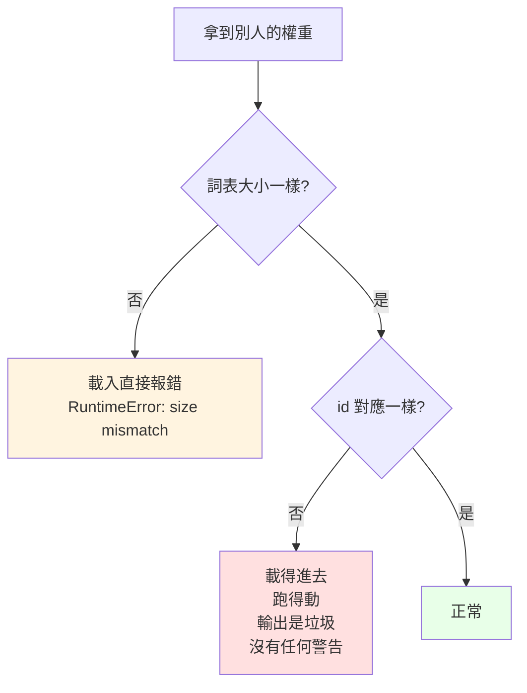

# 權重與 tokenizer 是綁死的

> 「別人拿到這些權重做 continual pre-training，tokenizer 也要一樣才行，對嗎？」

**對，而且比多數人以為的更嚴格。**

不只詞表大小要一樣——**每一個 token 對應到哪個 id，都必須完全相同**。

---

## 為什麼

`E` 的第 `v` 列，存的是「訓練期間 id = v 代表的那個 token」的向量。

```
訓練時   id 4 = '的'   →  E[4] 學成了「的」的向量
換 tokenizer 後   id 4 = '，'   →  模型拿「的」的向量去理解「，」
```

而且因為 weight tying，`E` 同時是輸出層——**輸入查表跟輸出分類會一起錯亂**。

---

## 實測：錯得有多離譜

```bash
python tests/test_tokenizer_binding.py
```

同一個模型、同一句話，只是把 id 對應打亂（模擬「同語料但不同種子重訓的 tokenizer」）：

| | loss | perplexity（等效於在幾個選項中猜） |
|---|---|---|
| 正確的 tokenizer | 3.61 | **37** |
| id 對應被打亂 | 12.87 | **389,971** |
| 完全沒訓練過的模型 | — | 6,400（= 詞表大小） |

**用錯 tokenizer 比完全沒訓練過的模型還糟 61 倍。**

為什麼會比隨機還差？因為隨機模型是均勻分布，至少「不確定」；
而載錯 tokenizer 的模型會**很有自信地猜錯**——把高機率押在錯誤的 token 上。

---

## 三種情況，危險程度不同



| 情況 | 會怎樣 | 危險嗎 |
|---|---|---|
| 詞表大小不同 | `RuntimeError: size mismatch` | **不危險**——馬上就知道出事了 |
| 大小相同、id 對應不同 | 安然載入、正常執行、輸出垃圾 | **非常危險**——沒有任何提示 |

第二種才是真正的坑。你會以為模型壞了、資料有問題、超參數不對，
花好幾天調參，實際上只是 tokenizer 拿錯了。

---

## 防呆：把 tokenizer 的指紋存進 checkpoint

這份專案的做法：

```python
# tokenizer/bpe.py
def fingerprint(self):
    s = '|'.join(self.itos) + '|'.join('%s>%s' % m for m in self.merges)
    return hashlib.sha256(s.encode('utf-8')).hexdigest()[:16]
```

指紋涵蓋 **id 的順序**（`itos` 是有序的），所以順序一變就會被抓到。

存檔時一起寫進去，載入時比對：

```python
model.save('out/model.pt', tokenizer_fingerprint=tok.fingerprint())
model.load('out/model.pt', tokenizer_fingerprint=tok.fingerprint())
```

拿錯就直接擋下來：

```
ValueError: tokenizer 不符！
  權重存檔時用的 : dcb6ef062b94a20e
  現在載入的     : deadbeefdeadbeef
  詞表大小可能一樣，但 id 對應不同——模型會照跑，輸出卻是垃圾。
  要強制載入請傳 strict_tokenizer=False。
```

**這是 20 行程式碼就能省下好幾天除錯時間的那種投資。**

---

## 但指紋只能「驗證」，不能「尋找」

指紋會告訴你「手上這份不對」，卻不會告訴你「對的在哪」。這個差別看起來很小，
實際上這份專案自己就踩過：

`generate.py` 當初是用猜檔名的方式找 tokenizer——

```python
tp = 'out/tokenizer_bpe.json' if os.path.exists('out/tokenizer_bpe.json') else 'out/tokenizer_char.json'
```

平常沒事，因為 `out/` 底下只有一份詞表。但只要跑過一次 `tests/test_bpe.py`，
就會多出一份 6,400 的 BPE 詞表，於是這行開始把 6,400 的詞表交給 3,195 的權重。
指紋確實擋下來了（這是好事），可是使用者收到的是「不符」，不是「對的那份在這裡」。

所以 checkpoint 要存的不只是指紋，還有 tokenizer 的**身分**：

```python
model.save('out/model.pt',
           tokenizer_fingerprint=tok.fingerprint(),   # 用來驗證：這份對不對
           tokenizer_path=tok_path,                   # 用來尋找：對的在哪
           tokenizer_kind=args.tokenizer)
```

`tokenizer/resolve.py` 就照這個順序找：

| 順序 | 依據 | 用在什麼情況 |
|---|---|---|
| ① | checkpoint 記的 `tokenizer_path` | 正常情況，直接讀，不用猜 |
| ② | 指紋比對候選詞表 | 舊 checkpoint 沒存路徑，或詞表被搬走了 |
| ③ | 明確報錯，列出試過哪些、指紋各是多少 | 真的找不到——講清楚，而不是丟 `IndexError` |

跑起來會告訴你它是怎麼決定的：

```
tokenizer: out/tokenizer_char.json（char，詞表 3,195，來源：checkpoint 記錄的路徑）
```

**教訓**：「靠檔案系統的狀態去推斷模型的身分」是個很容易寫出來、又很難發現的錯。
它在乾淨環境下永遠正常，只在「跑過別的東西之後」才出錯。
模型的身分應該由模型自己攜帶。

---

## 如果真的需要改 tokenizer

### 可以：擴充（append）

保留原有的 id `0..V-1` 完全不動，只在**後面**接新的列：

```python
p[:old_vocab].copy_(old_E)              # 原有 id 原封不動
p[old_vocab:] = old_E.mean(0)           # 新列用既有向量的平均值起步
```

實測（詞表 6,400 → 6,450）：

```
同一句話的 loss = 3.6130   （原本 3.6129，差 0.0000）
```

**幾乎沒有影響**，因為原有的 id 對應沒被動到。這就是做語言擴充、
加領域詞彙時的標準做法。

新列的初始化有幾種常見選擇：

| 做法 | 說明 |
|---|---|
| 既有向量的平均 | 最簡單，起點中性 |
| 小亂數 | 跟從頭訓練一致 |
| **子詞平均** | 新 token 是 `機器學習`，就用 `機`、`器`、`學`、`習` 四個舊向量的平均 |

第三種通常最好——新 token 一開始就落在語意上合理的位置。

### 不行：重建（rebuild）

用新語料重訓一個 tokenizer，即使詞表大小相同、甚至詞彙集合相同，
**只要 id 的分配順序不同，權重就報廢了**。

BPE 的 id 順序取決於合併的順序，而合併順序取決於語料的統計。
換語料、換種子、甚至換一個實作的 tie-breaking 規則，順序就會不一樣。

### 折衷：詞表移植（tokenizer transplant）

如果非換不可，可以做「字串比對搬家」：

```
對新詞表的每個 token：
    如果舊詞表裡有同樣的字串  →  把舊向量搬過來
    否則                      →  用子詞平均初始化
```

能救回一部分，但一定會掉品質，需要再訓練一段時間補回來。
業界做跨語言適配時常用這招，但那是不得已，不是首選。

---

## 一句話

> **權重跟 tokenizer 是一組的，發布時要一起發布，換模型時要一起換。**
>
> 只能往後擴充，不能重建。

這也是為什麼 HuggingFace 上的模型 repo 一定會把 `tokenizer.json`
跟 `model.safetensors` 放在同一個目錄——它們不是兩個獨立的東西。
