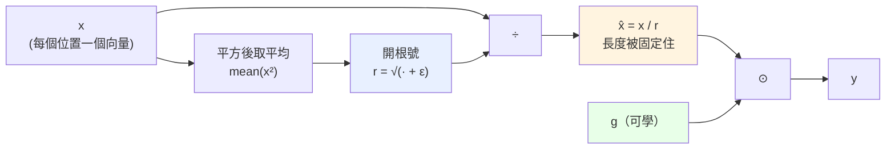
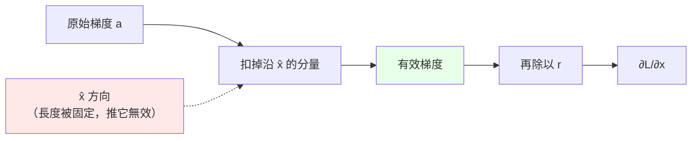

# RMSNorm

對應程式碼：`scratch/rmsnorm.py`

每一層的入口都會先過它。整個模型裡它的參數量最少（每層只有 $d$ 個），
但影響最大——**它決定了進入 Attention 和 FFN 的數值尺度**。

---

## 前向

$$
r = \sqrt{\frac{1}{n}\sum_{k=1}^{n} x_k^2 + \varepsilon}
$$

$$
\hat{x} = \frac{x}{r}
$$

$$
y = g \odot \hat{x}
$$

三個步驟，三個角色：

| 符號 | 是什麼 | 可學嗎 |
|---|---|---|
| $r$ | 這一列數字的**均方根**（root-mean-square） | 否，算出來的 |
| $\hat{x}$ | 正規化後的向量，長度被拉到約 $\sqrt{n}$ | 否 |
| $g$ | 每個維度一個的縮放係數 | **是**，初始值全為 $1$ |
| $\varepsilon$ | 防止除以零，預設 $10^{-5}$ | 否，固定常數 |

**沿哪一維做正規化很重要**：是沿**最後一維**（特徵維度），
所以每個位置各自正規化，位置與位置之間互不影響。

---

## 跟 LayerNorm 的差別

$$
\text{LayerNorm:}\quad y = g \odot \frac{x - \mu}{\sqrt{\sigma^2 + \varepsilon}} + b
$$

$$
\text{RMSNorm:}\quad y = g \odot \frac{x}{\sqrt{\operatorname{mean}(x^2) + \varepsilon}}
$$

RMSNorm **少了兩樣東西**：

1. 不減平均數 $\mu$
2. 沒有偏置 $b$

少一次減法、少一組參數，實測效果幾乎一樣。所以現在的 LLM
（LLaMA、Mistral、Qwen、minimind）幾乎都用 RMSNorm。

---

## 實際數值

從 `traces/sample/train_step_0001.txt` 抓的第一層 `norm1`：

| | 前 4 個維度 |
|---|---|
| $x$（輸入） | $+0.01647\quad -0.04764\quad +0.02504\quad +0.00472$ |
| $r$ | $0.019711$ |
| $\hat{x}$（正規化後） | $+0.83548\quad -2.41710\quad +1.27034\quad +0.23929$ |
| $g$（初始值） | $+1.00000\quad +1.00000\quad +1.00000\quad +1.00000$ |
| $y$（輸出） | $+0.83548\quad -2.41710\quad +1.27034\quad +0.23929$ |

驗算第一個維度：

$$\hat{x}_1 = \frac{0.01647}{0.019711} = 0.83557 \approx 0.83548$$

（差在四捨五入。）

**注意這個放大倍率**：

$$\frac{1}{r} = \frac{1}{0.019711} = 50.7$$

embedding 出來的向量很小（每個元素約 $0.02$），RMSNorm 把它們放大了 50 倍。
這不是 bug，正是它的用途——**把不同來源、不同尺度的向量統一到同一個工作區間**。

---

## 反向（逐步推導）

設 $n$ 是維度數，$a_i = \dfrac{\partial L}{\partial y_i}\,g_i$。

### 第一步：$r$ 對 $x$ 的偏導

$$r = \left(\frac{1}{n}\sum_k x_k^2 + \varepsilon\right)^{1/2}$$

用連鎖律：

$$
\frac{\partial r}{\partial x_j}
= \frac{1}{2}\left(\frac{1}{n}\sum_k x_k^2 + \varepsilon\right)^{-1/2}\cdot\frac{2x_j}{n}
= \frac{x_j}{n\,r}
$$

### 第二步：$y$ 對 $x$ 的偏導

這裡是關鍵——$y_i$ 透過**兩條路**依賴 $x_j$：

1. 分子裡的 $x_i$ 本身（只有 $i = j$ 時）
2. 分母 $r$ 裡面也含有 $x_j$（每個 $j$ 都有）

$$y_i = g_i\,\frac{x_i}{r}$$

用商法則：

$$
\frac{\partial y_i}{\partial x_j}
= g_i\left[\frac{\delta_{ij}}{r} - \frac{x_i}{r^2}\cdot\frac{\partial r}{\partial x_j}\right]
= g_i\left[\frac{\delta_{ij}}{r} - \frac{x_i\,x_j}{n\,r^3}\right]
$$

其中 $\delta_{ij}$ 是 Kronecker delta（$i=j$ 時為 $1$，否則為 $0$）。

### 第三步：鏈鎖律加總

$$
\frac{\partial L}{\partial x_j}
= \sum_i \frac{\partial L}{\partial y_i}\cdot\frac{\partial y_i}{\partial x_j}
= \frac{a_j}{r} - \frac{x_j}{n\,r^3}\sum_i a_i x_i
$$

### 第四步：化簡

把 $x = \hat{x}\,r$ 代入第二項：

$$
\frac{x_j}{n\,r^3}\sum_i a_i x_i
= \frac{\hat{x}_j\,r}{n\,r^3}\cdot r\sum_i a_i \hat{x}_i
= \frac{\hat{x}_j}{r}\cdot\frac{1}{n}\sum_i a_i\hat{x}_i
$$

得到最後要寫進程式的形式：

$$
\boxed{\;\frac{\partial L}{\partial x} = \frac{1}{r}\Bigl(a - \hat{x}\cdot\operatorname{mean}(a \odot \hat{x})\Bigr),
\qquad a = \frac{\partial L}{\partial y}\odot g\;}
$$

### 對 $g$ 的梯度

單純得多，因為 $y = g \odot \hat{x}$ 裡 $g$ 只出現一次：

$$\frac{\partial L}{\partial g} = \sum_{\text{所有位置}} \frac{\partial L}{\partial y} \odot \hat{x}$$

---

## 第二項在做什麼

$$-\,\hat{x}\cdot\operatorname{mean}(a \odot \hat{x})$$

它的作用是**把梯度中沿著 $\hat{x}$ 方向的分量扣掉**。

理由：$\hat{x}$ 的長度已經被 $r$ 固定住了（$\|\hat{x}\| = \sqrt{n}$）。
沿著它自己的方向推，只會改變長度——而長度馬上又會被正規化消掉，
所以那個方向的梯度**是無效的**，扣掉才正確。

幾何上，這是把梯度**投影到與 $\hat{x}$ 垂直的超平面上**。

---

## 一個實測現象：梯度會被放大

前向除以 $r = 0.0197$，反向經過同一個除法時，梯度也會被放大差不多的倍數。

這就是為什麼**梯度從第 1 層傳到 embedding 時會突然大一個數量級**。

實測倍率會比 $1/r = 50.7$ 略小，因為第二項扣掉了一部分。

---

## 驗證

`tests/test_layers.py` 用有限差分驗證這一層：

$$\frac{\partial L}{\partial w} \approx \frac{L(w+\varepsilon) - L(w-\varepsilon)}{2\varepsilon}$$

結果：最大相對誤差 $2.13\times10^{-7}$，**PASS**。

（這一層的誤差比 Linear 的 $10^{-12}$ 大，是因為它含有開根號和除法，
浮點運算的累積誤差比較多。$10^{-7}$ 對 `float64` 來說仍在合理範圍。）
