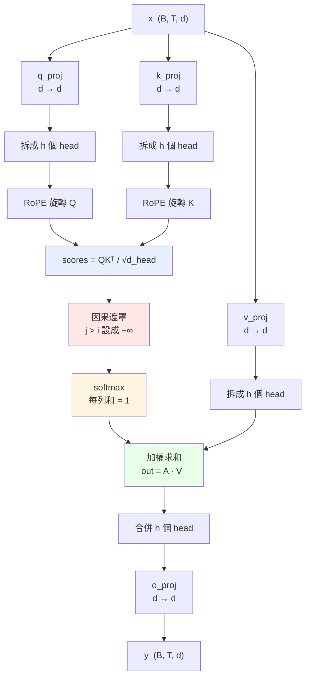
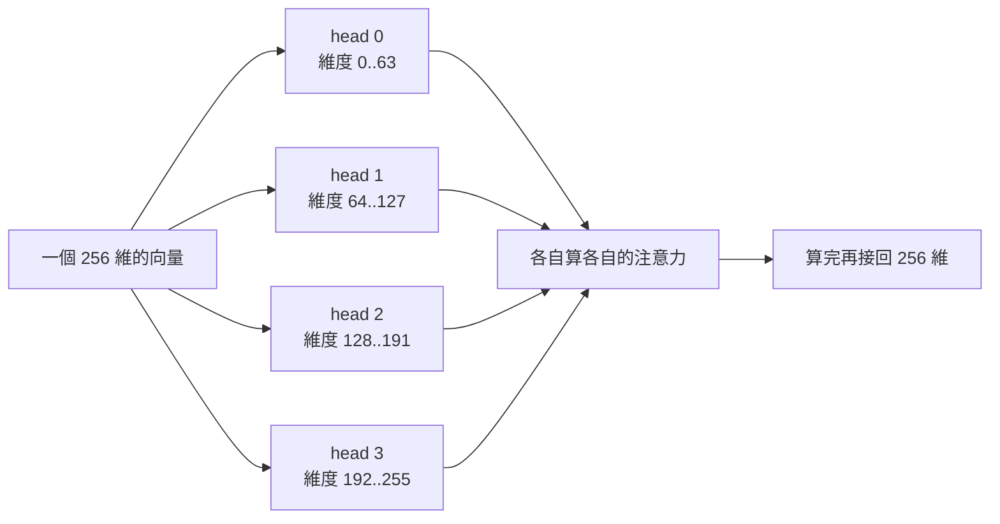
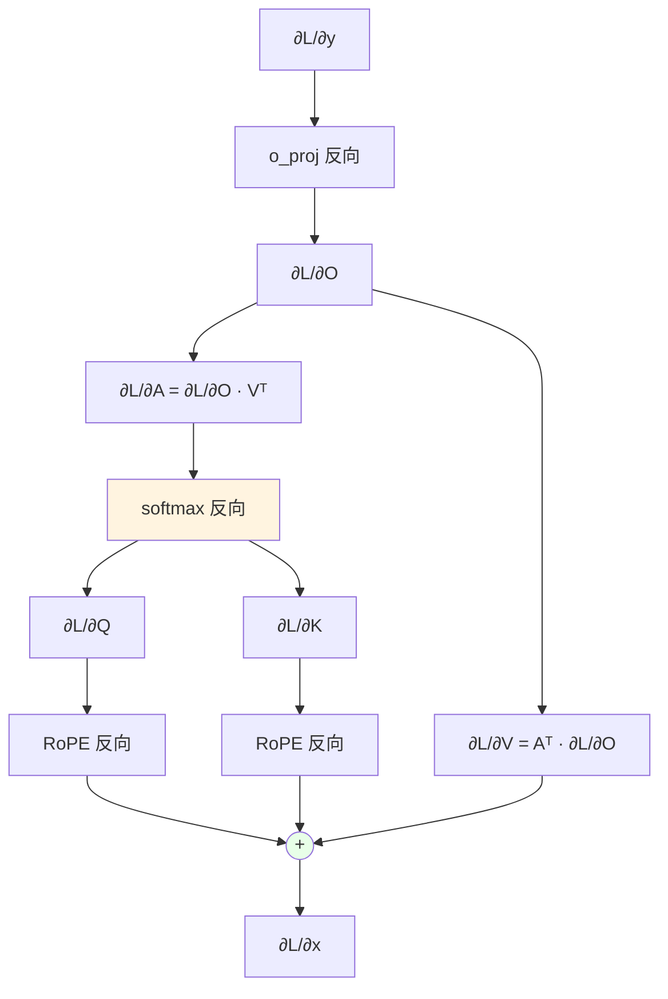

# Attention 的結構

對應程式碼：`scratch/attention.py`

整個模型裡**唯一讓不同位置互相看得到**的地方。FFN 是每個位置各做各的，
只有 Attention 會橫向交換資訊。

---

## 全貌

注意 **V 不做 RoPE**——位置資訊只需要影響「誰該注意誰」（分數），
不需要影響「注意到之後拿到什麼內容」。

---

## 一、三條投影

$$Q = xW_Q^{\top}, \qquad K = xW_K^{\top}, \qquad V = xW_V^{\top}$$

同一個 x 走了三條獨立的線性層，產生三個角色：

| | 名稱 | 直覺 |
|---|---|---|
| Q | Query，查詢 | 「我在找什麼」 |
| K | Key，鍵 | 「我是什麼」 |
| V | Value，值 | 「我能提供什麼內容」 |

因為 x 分岔成三路，**反向時三份梯度要相加**：

$$\frac{\partial L}{\partial x} = \frac{\partial L}{\partial x}\bigg\rvert_{Q} + \frac{\partial L}{\partial x}\bigg\rvert_{K} + \frac{\partial L}{\partial x}\bigg\rvert_{V}$$

---

## 二、拆成多個 head

$$(B,\,T,\,d) \;\longrightarrow\; (B,\,h,\,T,\,d_{\text{head}}), \qquad d_{\text{head}} = \frac{d}{h}$$

**不是複製四份，是把 256 維切成四段**，每段獨立算注意力。
這樣參數量完全沒增加，但模型可以同時關注不同類型的關係
（例如一個 head 管語法、一個管指代）。

---

## 三、注意力分數

$$S = \frac{QK^{\top}}{\sqrt{d_{\text{head}}}}$$

Sᵢⱼ 的意思是「位置 i 對位置 j 的關注程度」，本質是兩個向量的點積。

### 為什麼要除以 √d_head

假設 Q、K 各維度獨立、變異數約為 1，那麼點積

$$S_{ij} = \sum_{k=1}^{d_{\text{head}}} q_{ik}\,k_{jk}$$

是 d_head 個獨立項的和，變異數變成 d_head，標準差 √d_head。

d_head = 64 時，分數會散到 ± 8 以上。softmax 吃到這種輸入會變得**極度尖銳**
（幾乎變成 one-hot），而 softmax 在飽和區的梯度趨近於零——**梯度就消失了**。

除以 √d_head 把變異數拉回 1，softmax 才處在有梯度的區間。

實測本專案的設定：d_head = 64，scale = 1/√64 = 0.125。

---

## 四、因果遮罩

語言模型只能用「已經看過的字」預測下一個字。所以位置 i 只能注意 j ≤ i：

$$S_{ij} \leftarrow -\infty \quad \text{if } j > i$$

exp(-∞) = 0，所以那些位置的注意力權重變成 0，等於不存在。

遮罩矩陣長這樣（✓ 可以看，空白被擋住）：

| | j=0 | j=1 | j=2 | j=3 | j=4 |
|---|:---:|:---:|:---:|:---:|:---:|
| **i=0** | ✓ | | | | |
| **i=1** | ✓ | ✓ | | | |
| **i=2** | ✓ | ✓ | ✓ | | |
| **i=3** | ✓ | ✓ | ✓ | ✓ | |
| **i=4** | ✓ | ✓ | ✓ | ✓ | ✓ |

**下三角**。這也是為什麼一次前向就能同時訓練 T 個位置的預測——
每個位置看到的都是「只到自己為止」的資訊，互不干擾。

---

## 五、softmax

$$A = \operatorname{softmax}(S), \qquad A_{ij} = \frac{\exp(S_{ij})}{\sum_k \exp(S_{ik})}$$

沿**最後一維**做，所以每一列加起來等於 1：

$$\sum_j A_{ij} = 1 \quad \text{對每個 } i$$

實際跑出來的注意力矩陣（`traces/sample/train_step_0001.txt`，第 0 個 head，訓練第 1 步）：

| | j=0 | j=1 | j=2 | j=3 | j=4 | 列和 |
|---|---:|---:|---:|---:|---:|---:|
| **i=0** | 1.00000 | | | | | 1.0 |
| **i=1** | 0.43477 | 0.56523 | | | | 1.0 |
| **i=2** | 0.35364 | 0.28259 | 0.36377 | | | 1.0 |
| **i=3** | 0.21434 | 0.32812 | 0.22678 | 0.23077 | | 1.0 |
| **i=4** | 0.23005 | 0.15862 | 0.16002 | 0.20928 | 0.24203 | 1.0 |

三件事一眼可見：

1. **上三角全是空的**——因果遮罩生效了
2. **每列和都是 1.0**——softmax 正確
3. **權重相當平均**（i=4 那列都在 0.16 ~ 0.24 之間）——因為這是**訓練第 1 步**，
   權重還是亂數，模型還不知道該注意誰。訓練久了會出現明顯的尖峰。

---

## 六、加權求和與合併

$$O = AV, \qquad O_i = \sum_j A_{ij}\,V_j$$

每個位置的輸出，是**所有它看得到的位置的 V 的加權平均**，權重就是注意力。

$$(B,\,h,\,T,\,d_{\text{head}}) \;\longrightarrow\; (B,\,T,\,d) \;\xrightarrow{\;W_O\;}\; y$$

`o_proj` 的作用是把各個 head 的結果**混合**起來——沒有它，各 head 算完就直接拼接，
彼此之間永遠不會互動。

---

## 反向

### 對 A 與 V

O = AV 是矩陣乘法，套用標準結果：

$$\frac{\partial L}{\partial A} = \frac{\partial L}{\partial O}V^{\top},
\qquad
\frac{\partial L}{\partial V} = A^{\top}\frac{\partial L}{\partial O}$$

（又是「點積對一邊微分得到另一邊」。）

### softmax 的完整反向

這裡**沒有** cross-entropy 接在後面，所以不能用 p - y 那個簡化，
必須用完整形式。對每一列 i 獨立：

$$\frac{\partial A_{ij}}{\partial S_{ik}} = A_{ij}\left(\delta_{jk} - A_{ik}\right)$$

$$
\boxed{\;\frac{\partial L}{\partial S_{ij}}
= A_{ij}\left(\frac{\partial L}{\partial A_{ij}} - \sum_k \frac{\partial L}{\partial A_{ik}}A_{ik}\right)\;}
$$

括號裡那個 Σ 是**這一列的加權平均**，每列算一次就好，不需要真的建出 T × T 的 Jacobian。

**遮罩不用特別處理**：被遮住的位置 Aᵢⱼ = 0，
公式最前面的 Aᵢⱼ 自動讓那些梯度也是 0。

### 對 Q 與 K

$$\frac{\partial L}{\partial Q} = \frac{1}{\sqrt{d_{\text{head}}}}\,\frac{\partial L}{\partial S}\,K,
\qquad
\frac{\partial L}{\partial K} = \frac{1}{\sqrt{d_{\text{head}}}}\left(\frac{\partial L}{\partial S}\right)^{\!\top} Q$$

---

## 記憶體：為什麼 Attention 是 O(T²)

分數矩陣的形狀是

$$S \in \mathbb{R}^{B \times h \times T \times T}$$

以 B=64、h=4、T=128 為例：

$$64 \times 4 \times 128 \times 128 = 4.19 \times 10^{6}$$

序列長度加倍，這個張量會變成**四倍**。而且訓練時 A 要存下來給反向用。

這就是長 context 昂貴的根本原因，也是 FlashAttention 這類技術要解決的問題
（它的作法是分塊計算、不把完整的 S 物化出來）。

---

## 驗證

`tests/test_layers.py` 對這一層的有限差分驗證：
最大相對誤差 3.32×10⁻⁷，**PASS**。

含 softmax Jacobian、因果遮罩、RoPE 反向、三路梯度相加，全部推對。
