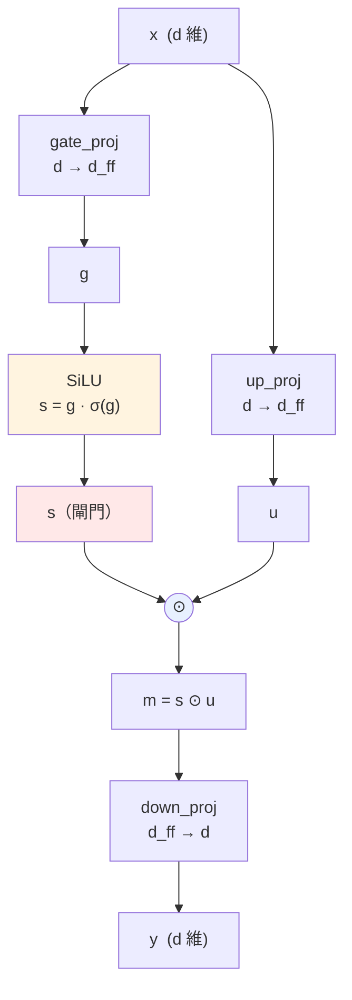
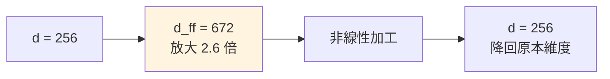
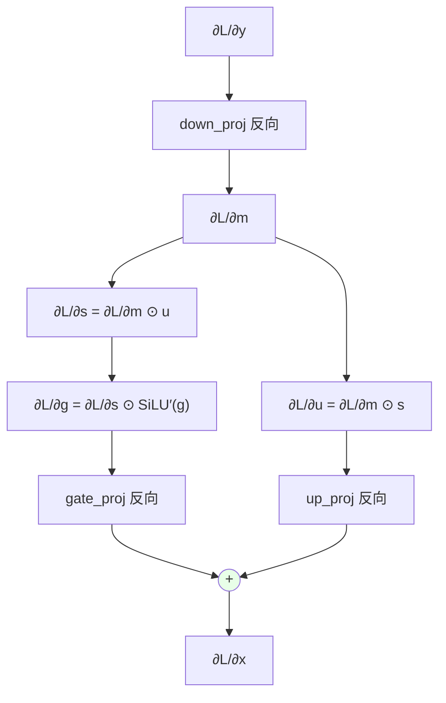

# FFN 的結構（SwiGLU）

對應程式碼：`scratch/swiglu.py`

Attention 負責**橫向**（位置之間交換資訊），FFN 負責**縱向**（每個位置各自加工）。
FFN 對第 7 個位置做的事，跟它對第 13 個位置做的事完全獨立。

而且它是每一層裡**參數量最大**的部分——通常佔三分之二以上。

---

## 全貌

$$
g = xW_{\text{gate}}^{\top},
\qquad
u = xW_{\text{up}}^{\top},
\qquad
s = \operatorname{SiLU}(g),
\qquad
m = s \odot u,
\qquad
y = mW_{\text{down}}^{\top}
$$

寫成一行：

$$\boxed{\;y = \Bigl(\operatorname{SiLU}\bigl(xW_{\text{gate}}^{\top}\bigr) \odot xW_{\text{up}}^{\top}\Bigr)W_{\text{down}}^{\top}\;}$$

---

## 跟原始 Transformer 的 FFN 比較

$$\text{原始（2017）:}\quad y = \operatorname{ReLU}\bigl(xW_1 + b_1\bigr)W_2 + b_2$$

$$\text{SwiGLU:}\quad y = \Bigl(\operatorname{SiLU}(xW_{\text{gate}}) \odot xW_{\text{up}}\Bigr)W_{\text{down}}$$

| | 原始 | SwiGLU |
|---|---|---|
| 矩陣數 | 2 | **3** |
| 非線性 | ReLU | SiLU（平滑，處處可微） |
| 閘門機制 | 無 | **有**（多出來的 up 那一路） |
| bias | 有 | 無 |

多出來的那一路 u 的作用是**開關**：s 決定 u 的每個維度要放行多少。

因為多了一個矩陣，為了維持總參數量相當，d_ff 通常取 8/3d
而不是傳統的 4d。

---

## 為什麼要先升維再降回來

在高維空間裡，資料更容易被非線性「切開」。先升維、加工、再壓回來——
這是 FFN 的標準套路。

**參數量因此很可觀**：

$$\left|\theta_{\text{FFN}}\right| = 3 \times d \times d_{\text{ff}} = 3 \times 256 \times 672 = 516{,}096$$

$$\left|\theta_{\text{Attention}}\right| = 4 \times d^2 = 4 \times 256^2 = 262{,}144$$

FFN 大約是 Attention 的兩倍。**一層裡三分之二的參數都在 FFN。**

---

## SiLU 這個非線性

$$\operatorname{SiLU}(z) = z\,\sigma(z) = \frac{z}{1 + e^{-z}}$$

（也叫 Swish。）

| z | σ(z) | SiLU(z) |
|---:|---:|---:|
| -3 | 0.047 | -0.142 |
| -1 | 0.269 | -0.269 |
| 0 | 0.500 | 0.000 |
| 1 | 0.731 | 0.731 |
| 3 | 0.953 | 2.858 |

跟 ReLU 比：

- **負數區不是直接砍成 0**，而是留下一點負值（最小值約 -0.278）。
  ReLU 的「死神經元」問題（一旦進入負區梯度永遠是 0）在這裡不存在。
- **處處可微**，沒有 ReLU 在 z=0 的折點。

導數（用 σ' = σ(1-σ) 推）：

$$
\operatorname{SiLU}'(z) = \sigma(z) + z\,\sigma(z)\bigl(1-\sigma(z)\bigr)
= \sigma(z)\Bigl(1 + z\bigl(1 - \sigma(z)\bigr)\Bigr)
$$

---

## 閘門在做什麼（用真實數值看）

從 `traces/sample/train_step_0001.txt` 抓的第一層 FFN，前 4 個維度：

| 維度 | g（gate） | s = SiLU(g) | u（up） | m = s ⊙ u |
|---:|---:|---:|---:|---:|
| 1 | -1.00882 | -0.26957 | -0.59599 | +0.16066 |
| 2 | -0.32442 | -0.13613 | +0.28378 | -0.03863 |
| 3 | +0.33926 | +0.19813 | -0.03482 | -0.00690 |
| 4 | -1.21415 | -0.27800 | -0.69361 | +0.19282 |

驗算第 1 個維度：

$$\operatorname{SiLU}(-1.00882) = -1.00882 \times \sigma(-1.00882) = -1.00882 \times 0.2672 = -0.2696\;\checkmark$$

$$m_1 = s_1 \times u_1 = (-0.26957) \times (-0.59599) = +0.16066\;\checkmark$$

看第 3 個維度：u₃ = -0.03482 本身就很小，乘上 s₃ = 0.198 之後
變成 -0.0069——**幾乎被關掉了**。這就是 gating：
即使 u 那一路算出了東西，s 可以決定讓它過多少。

---

## 反向

逐條寫出來：

$$\frac{\partial L}{\partial m} = \text{down\_proj.backward}\!\left(\frac{\partial L}{\partial y}\right)$$

m = s ⊙ u 是逐元素相乘，對一邊微分得到另一邊：

$$\frac{\partial L}{\partial s} = \frac{\partial L}{\partial m} \odot u,
\qquad
\frac{\partial L}{\partial u} = \frac{\partial L}{\partial m} \odot s$$

再過 SiLU 的導數：

$$\frac{\partial L}{\partial g} = \frac{\partial L}{\partial s} \odot \operatorname{SiLU}'(g)$$

最後兩路回到 x，**梯度相加**：

$$\frac{\partial L}{\partial x}
= \text{gate\_proj.backward}\!\left(\frac{\partial L}{\partial g}\right)
+ \text{up\_proj.backward}\!\left(\frac{\partial L}{\partial u}\right)$$

x 同時餵給 gate 和 up 兩條路，所以反向要把兩份加起來——
**前向分岔，反向相加**，這條通則在整份程式碼裡反覆出現。

---

## 記憶體：FFN 是訓練時的活化值大戶

反向需要用到 g、s、u，所以前向時全都要存下來。
每一個的形狀都是 (B,T,d_ff)。

以 B=64、T=128、d_ff=672、bf16 為例，單一個張量：

$$64 \times 128 \times 672 \times 2\,\text{bytes} = 11\,\text{MB}$$

一層要存三個（g、s、u）約 33 MB，四層就是 132 MB。

這就是「訓練比推論吃記憶體」的主因之一——**推論不用存這些，算完就丟**。

---

## 驗證

`tests/test_layers.py` 對這一層的有限差分驗證：
最大相對誤差 1.69×10⁻⁶，**PASS**。

（這是九層裡誤差最大的一個，因為 SiLU 的導數含有 σ(1-σ)，
連續兩次浮點運算的誤差會累積。10⁻⁶ 仍在合理範圍。）
